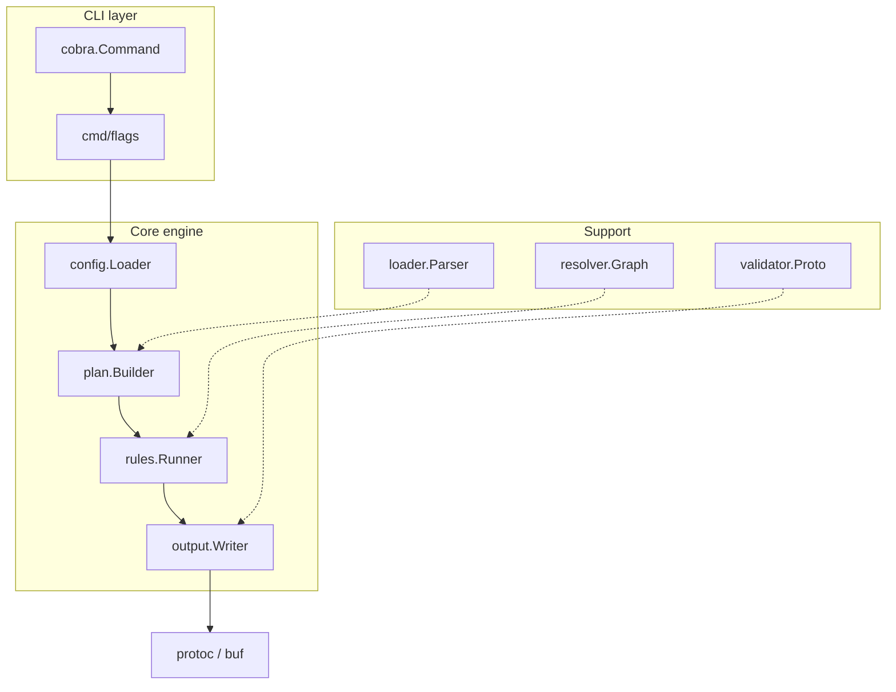

# ProtoMigrate — Internal Design

> A deeper dive into the engine, package layout, algorithms, and extension
> points. Intended for maintainers and advanced contributors.

---

## 1. Architectural overview



- **cmd/** — thin CLI surface.
- **internal/config** — parses `.proto-sync.yaml`.
- **internal/loader** — walks FS / Buf modules, parses protos to descriptors.
- **internal/transform** — collection of `Rule` implementations.
- **internal/resolve** — dependency graph + import/option rewrite helpers.
- **internal/engine** — orchestrates plan → diff → apply → validate.
- **pkg/** — minimal public API (`protosync.Run(ctx,cfg)`).

---

## 2. Rule interface

```go
type Rule interface {
    ID() string
    Apply(fd *desc.FileDescriptor) (changed bool, err error)
}

func RegisterRule(id string, new func() Rule)
```

Bundled rules:

| ID               | Purpose                              |
| ---------------- | ------------------------------------ |
| `package.rename` | Update `package` declaration         |
| `service.rename` | Rename `service Foo` → `service Bar` |
| `import.rewrite` | Adjust `import` paths                |
| `option.go_pkg`  | Update `go_package` option           |
| `regexp.replace` | Generic regex substitution           |

---

## 3. Import-resolution algorithm

1. **Graph build** – canonicalise paths, record edges.
2. **Relocation map** – derived from rules; maps prefix → new prefix.
3. **Rewrite** import strings & language options.
4. **Vendoring** – `--vendor-deps` copies unknown externals to `vendor/`.
5. **Validation** – `protoc` dry-run + `buf lint/breaking`.

---

## 4. File I/O & atomicity

- Write changes into `$TMPDIR/proto-migrate-<pid>/`.
- After success, `os.Rename` into place.
- Ctrl-C before rename leaves repo untouched.
- `--dry-run` exits before any write.

---

## 5. Tests

```
internal/
  transform/
    package_test.go
  resolve/
    graph_test.go
testdata/
  old_package/...
  new_package/...
```

`make test` runs vet, staticcheck, unit tests, and sample `buf lint`.

---

## 6. Performance

- Parsing parallelised with GOMAXPROCS.
- Descriptor cache prevents duplicate work for shared imports.
- ≈10 k files plan+diff in ≈600 ms on modern laptops.
